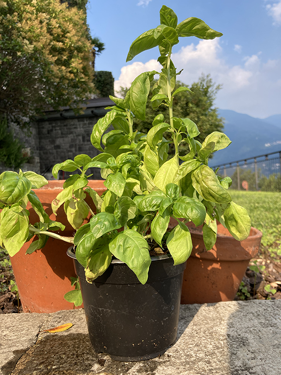

# Spezie

* basilico
* salvia
* timo
* rosmarino
* prezzemolo
* melissa \(dolcissima\)
* erba cipollina
* alloro

Tutte le piante che illustro sotto sono state piantate con un fondo di argilla, per tenere il terreno umido, e senza sotto vaso, per favorire il drenaggio ed evitare ristagni. Quando ho potuto ho usato vasi in terracotta, altrimenti vasi in plastica.

Alcune piante le ho accoppiate in un unico vaso: 

* salvia - erba cipollina
*  lemon grass - melissa

### Basilico

10 consigli \([https://www.youtube.com/watch?v=CSdGGMQ3TCU](https://www.youtube.com/watch?v=CSdGGMQ3TCU)\):

* in un unico vaso coppie di piante a circa 10cm l'una dall'altra.
* substrato: compostaggio \(scarti giardino o cucina, foglie o scarti vegetali....dopo un anno\) alleggerito con argilla o agriperlite \(per evitare ristagno \) oppure fibra di cocco. 
* No sottovasi! Causa di morte precoce.
* concimazione: macerazione dell'ortica. \(macerare per almeno 24 ore ed aggiungere acqua in base a quanto sono macinati\)
* no fioritura, i fiori vanno tagliati. Il fiore si usa per recuperare i semi.
* difenderlo dalle lumache: sminuzzare guscio uovo, non troppo fini. Cospargerli attorno alla piante. Non si decompone.
* non tenerlo al sole diretto. ideale sole del mattino fino alle 11...poi in ombra fino a quando non è più forte. Il sole delle 18 va bene
* bagnatura: nebulizzare al mattino. oppure bagnare quando la terra appena sotto la superficie non è più umida. 
* le foglie da togliere sono quelle superiori, per stimolare la parte inferiore e renderla forte. 
* Humus di lombriche! Aiuta l'apparato radicale, non sostiuisce il concime.

### Salvia - Erba cipollina

Ho piantato la salvia assieme all'erba cipollina.

Tutto bene. La salvia dopo una settimane ha diverse foglioline nuove alla base, l\erba cipollina sembra crescere. Ho il sospetto che apprezzino entrambe l'acqua al mattino, ma non ho ancora ben capito come funziona.

#### Salvia

Fra le due sta vincendo la Salvia. Rigogliosa. 

In estate.

* Luce: in mezz'ombra. Non solo diretto. All'ombra o sotto una tettoia semitrasparente.
* Acqua: estate , tutte le mattine, terreno ben umido.

#### Erba cipollina

* Luce: ombra, no sole diretto. Acqua tutti i giorni, terra umida. Tagliare gli steli molto vicino alla terra.

